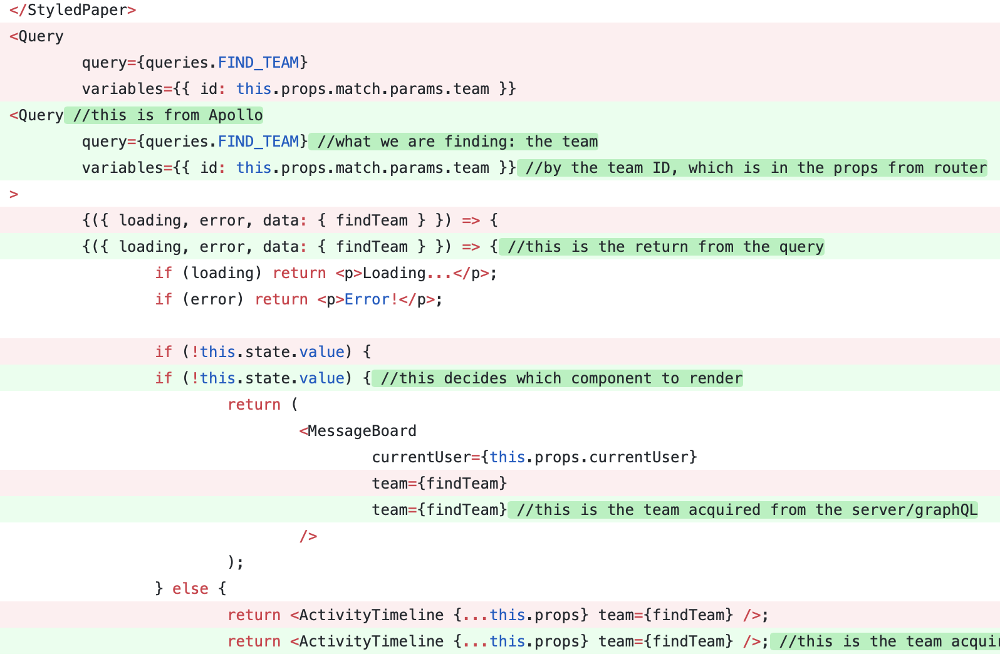

## Part 1 - Individual Accomplishments this Week

#### Your team’s github contribution graph here and indicate your Github

[StephenBondor](https://github.com/StephenBondor)

[Team Contribution Graph](https://github.com/Lambda-School-Labs/labs-team-home/graphs/contributors)

#### This week

This week we began the process of consuming the code base we inherited from the previous labs team. It is deployed [here](https://team-home.netlify.com/). We had to learn the code, learn the technology, and begin a refactoring process to make it our own.

#### Tasks Pulled

> List the tasks you pulled this week, and provide a link to the successfully merged PR completing that task and the trello card for that task. You must have at least one front end and one back end. The expected total is 6 with a minimum of 4.

**Ticket 1** [Github](https://github.com/Lambda-School-Labs/labs-team-home/commit/0345553cdf2bd3d0de92f9c1736ea89498a383db)
[Trello](https://trello.com/b/Ir0KPUDw/labs10-team-home-2)

**Ticket 2**
[Github](https://github.com/Lambda-School-Labs/labs-team-home/commit/4be84311b2e9cb403f319c6e7f7d5ed4877724bc)
[Trello](https://trello.com/b/Ir0KPUDw/labs10-team-home-2)

**Ticket 3**
[Github](https://github.com/Lambda-School-Labs/labs-team-home/commit/c940792e42ae031ce3d16da8fffbb03892705b30)
[Trello](https://trello.com/b/Ir0KPUDw/labs10-team-home-2)

**Ticket 4**
[Github](https://github.com/Lambda-School-Labs/labs-team-home/commit/acd0ddc5aa1a805cd337d04395371cb001502732)
[Trello](https://trello.com/b/Ir0KPUDw/labs10-team-home-2)

#### Detailed Analysis

> Pick one of your tickets and provide a detailed analysis of the work you did. This should be approximately ¼ page of text, and at least three screenshots.

_A preview of my code comments_

This is what it is like trying to understand code you have no idea about. I can not even speak to the validity of these comments as they were written but that is a part of the process. Most of the week felt like this:

But there is no other way to do it to learn the frameworks needed.

## Part 2

> As a part of your journal entry, write ¼ to ½ a page reflecting on your individual contributions to analyzing the project specification and writing the TDD. Describe the research you personally conducted to find out information on a competitor, investigate a technical solution to a specific problem, or define your customers.
> As a group, provide links to evidence that:
> Front end is deployed with a recognizable name. The site can be visited and will load a simple message
> Back end is deployed with a recognizable name. The address can be visited and will return data
> User models: Either through a tool, or the front end, user models with dummy data can be accessed.

In pursuit of this end I am writing this blog post.

This week was a difficult week. We spent most of the week trying to make up the technical debt we inherited from a project built on graphQL and mongoDB, two frameworks which no one in our group understood on Monday. However, here on Friday, I have deployed this very blog using graphQL.

### What Am I Doing?

As the self-proclaimed team organizational lead, last week, I took it upon myself to assign roles in our group and attempt to divide labor up and define rolls. I also lightly influenced the composition of our team by recruiting some of the best developers in our program in the fields our team composition may have been lacking in.

### TDD

As a group we (mostly my awesome team) authored our Technical Design Document on Monday and Tuesday, to meet our specifications. My personal contribution to this was giving the final read over and presenting the document and our plan to our Client in a 15 minute (ish) presentation.

In preparation for this, we played around with competitive products and got a feel for the kind of experience we were tasked with building.

We were accepted immediately, and moved onto development.

### Study

Upon gaining access to the repository, we began the long slog up hill trying to wrap our heads around the entirely foreign tech stack we now had to digest in days. In pursuit of this, much of time I spent this week was working through [this tutorial](https://www.howtographql.com/basics/2-core-concepts/) on graphQL, which is excellent.

### Deploy

It took us Tuesday Wednesday and Thursday to re-deploy the app (and rebuild our understanding) but we got it done.

[Server](http://team-home-2-graphql-mongodb.herokuapp.com)

[Front End](http://team-home-2.netlify.com)

Unfortunately, issues with Auth0 have been preventing us from logging in. We haev created a few work around solutions -- including depricating all the authentication logic and code (yikes) -- but we hope to soon find a solution here.

Seeing as how this project was given to us as a completed project, we did not need to build or touch any of the user models.
