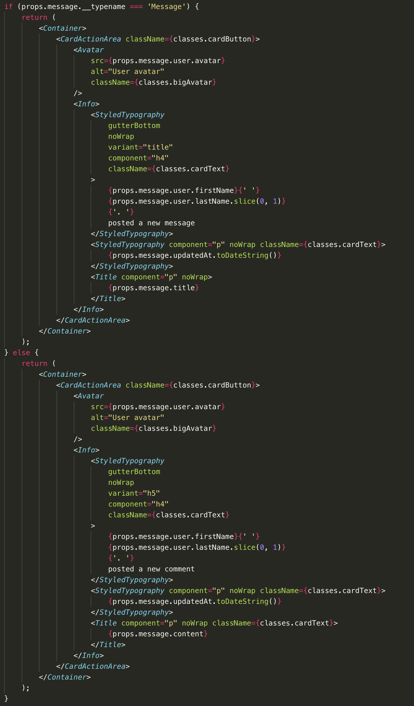
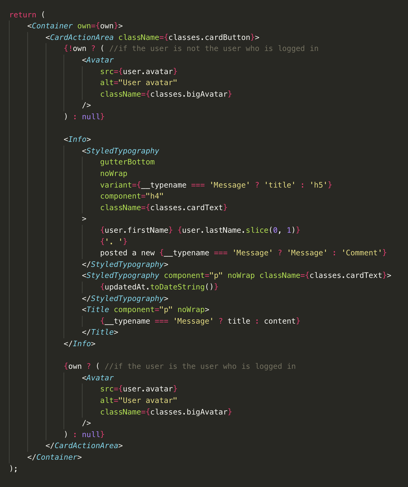
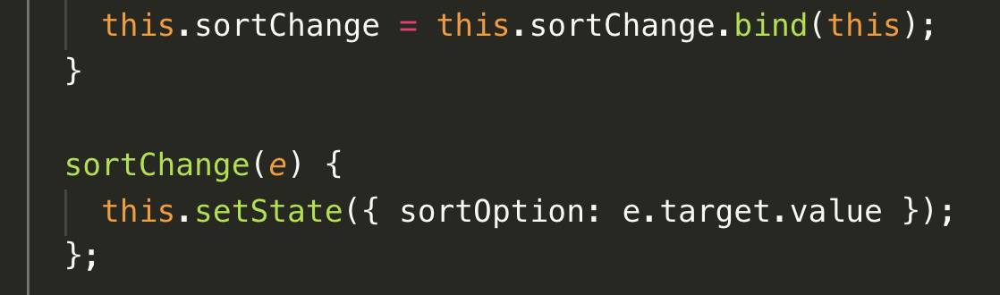
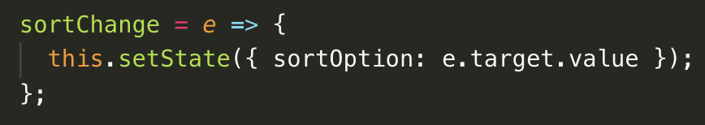
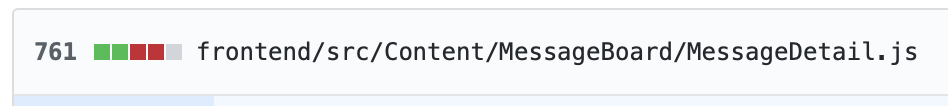
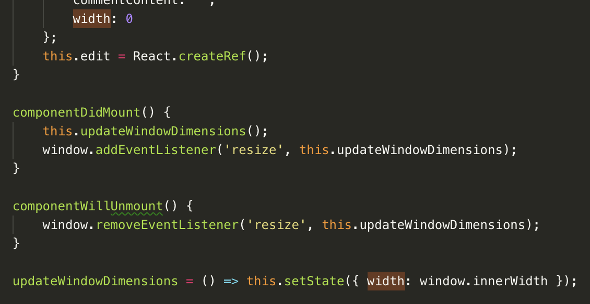
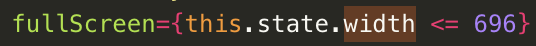

## Part 1 - Individual Accomplishments this Week

#### Your team’s github contribution graph and your Github:

[StephenBondor](https://github.com/StephenBondor)
-- [Team Contribution Graph](https://github.com/Lambda-School-Labs/labs-team-home/graphs/contributors)

#### This week

This week we began the process of refactoring and then adding to the code base we inherited from the previous labs team. Our new deploy is [here](https://team-home-2.netlify.com/).

#### Tasks Pulled

> > List the tasks you pulled this week, and provide a link to the successfully merged PR completing that task and the trello card for that task. You must have at least one front end and one back end. The expected total is 6 with a minimum of 4.

**Ticket 1**
[Github](https://github.com/Lambda-School-Labs/labs-team-home/pull/278)
[Trello](https://trello.com/b/Ir0KPUDw/labs10-team-home-2)
**Ticket 2**
[Github](https://github.com/Lambda-School-Labs/labs-team-home/pull/279)
[Trello](https://trello.com/b/Ir0KPUDw/labs10-team-home-2)
**Ticket 3**
[Github](https://github.com/Lambda-School-Labs/labs-team-home/pull/280)
[Trello](https://trello.com/b/Ir0KPUDw/labs10-team-home-2)
**Ticket 4**
[Github](https://github.com/Lambda-School-Labs/labs-team-home/pull/284)
[Trello](https://trello.com/b/Ir0KPUDw/labs10-team-home-2)
**Ticket 5**
[Github](https://github.com/Lambda-School-Labs/labs-team-home/pull/290)
[Trello](https://trello.com/b/Ir0KPUDw/labs10-team-home-2)
**Ticket 6**
[Github](https://github.com/Lambda-School-Labs/labs-team-home/pull/292)
[Trello](https://trello.com/b/Ir0KPUDw/labs10-team-home-2)
**Ticket 7**
[Github](https://github.com/Lambda-School-Labs/labs-team-home/pull/295)
[Trello](https://trello.com/b/Ir0KPUDw/labs10-team-home-2)
**Ticket 8**
[Github](https://github.com/Lambda-School-Labs/labs-team-home/pull/302)
[Trello](https://trello.com/b/Ir0KPUDw/labs10-team-home-2)
**Ticket 9**
[Github](https://github.com/Lambda-School-Labs/labs-team-home/pull/307)
[Trello](https://trello.com/b/Ir0KPUDw/labs10-team-home-2)
**Ticket 10**
[Github](https://github.com/Lambda-School-Labs/labs-team-home/pull/309)
[Trello](https://trello.com/b/Ir0KPUDw/labs10-team-home-2)
**Ticket 11**
[Github](https://github.com/Lambda-School-Labs/labs-team-home/pull/314)
[Trello](https://trello.com/b/Ir0KPUDw/labs10-team-home-2)

#### Detailed Analysis

> > Pick one of your tickets and provide a detailed analysis of the work you did. This should be approximately ¼ page of text, and at least three screenshots.

##### Code Deprecation, Refactoring, and Standardizing

So, this is not going to be pretty. Instead of choosing one pull request, I will be referring to many of the early pull requests this week that comprise many different issues which I hope to shed light on, that all flow from the topic of refactoring inherited code.

But first, a few caveats.

This code works. **Full stop.** It's not without its bugs, just like any other code, but it _works_. So, before we jump into the refactoring, this context needs to be in place. On top of that, their are extra-curricular circumstances I do not know, but, given the circumstances of Lambda Labs--circumstances that my team and I have seen thus far ourselves--we must assume that this pervious code was written under stress, with little time, and suffering from all communication issues inherent in all computer or internet based channels. To be clear, the fact that this code was shipped, in an of itself, is awesome. And for real, I make no claims that my code is not without bugs or any better, in fact, I expect that my code can be radically refactored to 1/10th the size. All I claim is that this refactoring is better consumable by my team give our context.

---

#### So lets dive in...

_Specimen #1_

This is one of two nearly identical components found in two files. Each renders according to if the user is the creator, or owner, of the content. As you can see, there are two eerily similar components rendered conditionally. Considering that together these components represent 120 lines of code, it seemed to me to be an easy win for the development teams code-consumption time to refactor this code into ~40 lines:

_Refactor of Specimen #1_

---

_Specimen #2_

Specimen #2 is rather interesting. As the famous Ashwin Sundararajan puts it:

> Arrow functions were introduced to javascript because basically most of the other languages had lambda functions and JS didn't. Though they were primarily intended to make FP easier, there was this weird request from the community to somehow have a lexical binding for `this` (again this is a feature for other OOP languages) and ECMA thought it would be a good idea to combine both of the needs. All in a day's work.

Effectively, this code can be refactored by using a JS arrow function. Though it only saves one line of code, it can saves on developer comprehension time as `.bind()` is hard to comprehend, rarely used, and this code is only a state change to begin with.

_Refactor of Specimen #2_

These small fixes can really add up after, say, refactoring a 580 line component with 700+ changes. Um, which is one thing that happened while refactoring...

_The mother of all component refactoring_

---

_Specimen #3_

To be honest, this one took me a long time to figure out. When I first approached this component I knew that this particular section was a bit over my head. But, the component was 580 lines long, so their was a good chance that I was not at the level needed to fully get it anyway. However, as I parsed and deconstructed the component, I found that there was only one other place this functionality could interact with, this line:

_Specimen #3b_

In effect, those 6 lines of code at the top are a JS and @materialUI solution to a inline CSS @media-query, which says: _when the window width is below a certain level, make the component full screen._

---

## Part 2

This weeks prompt should be divided into its appropriate sections:

> > As a part of your journal entry, write ¼ to ½ a page reflecting on your experiences forming a team. What did you do to help the team solidify as a group?

We have all worked together before, so answering this question really comes down to how we picked the group. And to that end, two of our members volunteered, and I reached out to the other 3 to bring them into the fold. In terms of making sure our group has been solidifying, I help make sure that all members are coordinated, and that no member is working on the exact same task, unless that task is particularly difficult.

> > What did you do that you now realize caused friction in this process?

Letting people decide their rolls instead of assigning them and asking for feedback or other suggestions.

> > What are you doing personally to make sure that everyone on the team, including you, has a voice in decision making?

First, generally, for someone to contribute, they need the right information set. They must have continual access to communication channels. Letting a teams communication break down will kill this goal and being strictly online, communication is naturally hindered. What is more, the nature of Labs naturally divides many of the groups. This dramatically reduces the knowledge base and magnifies problems. So, I try to get out of the way as much as possible, and put aside differences to get people in front of each other as much as I can. Specifically, when this is in place, I'll calling people out by name, tactfully, and asking for their opinion on a topic.

> > As a group, provide links to evidence that:
> > Front and back end servers are connected

[Front End](https://team-home-2.netlify.com/)
[Back End](https://team-home-2-graphql-mongodb.herokuapp.com/graphql)

> > Users can create accounts and log in through the front end via OAuth

[Deploy](https://team-home-2.netlify.com/)

> > All APIs and services are connected and can be interacted with through the front end. A test message is acceptable to meet this requirement

See above.
