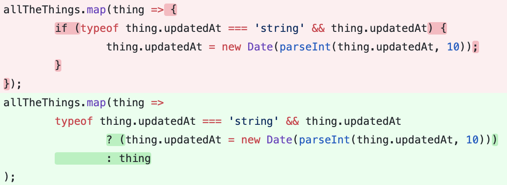

## Part 1 - Individual Accomplishments this Week

#### Your team’s github contribution graph and your Github:

[StephenBondor](https://github.com/StephenBondor)
-- [Team Contribution Graph](https://github.com/Lambda-School-Labs/labs-team-home/graphs/contributors)

#### This week

This week we began the process of refactoring and then adding to the code base we inherited from the previous labs team. Our new deploy is [here](https://team-home-2.netlify.com/).
Tasks Pulled

> > List the tasks you pulled this week, and provide a link to the successfully merged PR completing that task and the trello card for that task. You must have at least one front end and one back end. The expected total is 6 with a minimum of 4.

**Ticket 1**
[Github](https://github.com/Lambda-School-Labs/labs-team-home/pull/321)
[Trello](https://trello.com/b/Ir0KPUDw/labs10-team-home-2)
**Ticket 2**
[Github](https://github.com/Lambda-School-Labs/labs-team-home/pull/324)
[Trello](https://trello.com/b/Ir0KPUDw/labs10-team-home-2)
**Ticket 3**
[Github](https://github.com/Lambda-School-Labs/labs-team-home/pull/327)
[Trello](https://trello.com/b/Ir0KPUDw/labs10-team-home-2)
**Ticket 4**
[Github](https://github.com/Lambda-School-Labs/labs-team-home/pull/328)
[Trello](https://trello.com/b/Ir0KPUDw/labs10-team-home-2)
**Ticket 5**
[Github](https://github.com/Lambda-School-Labs/labs-team-home/pull/329)
[Trello](https://trello.com/b/Ir0KPUDw/labs10-team-home-2)
**Ticket 6**
[Github](https://github.com/Lambda-School-Labs/labs-team-home/pull/335)
[Trello](https://trello.com/b/Ir0KPUDw/labs10-team-home-2)
**Ticket 7**
[Github](https://github.com/Lambda-School-Labs/labs-team-home/pull/336)
[Trello](https://trello.com/b/Ir0KPUDw/labs10-team-home-2)
**Ticket 8**
[Github](https://github.com/Lambda-School-Labs/labs-team-home/pull/344)
[Trello](https://trello.com/b/Ir0KPUDw/labs10-team-home-2)
**Ticket 9**
[Github](https://github.com/Lambda-School-Labs/labs-team-home/pull/346)
[Trello](https://trello.com/b/Ir0KPUDw/labs10-team-home-2)

#### Detailed Analysis

> > Pick one of your tickets and provide a detailed analysis of the work you did. This should be approximately ¼ page of text, and at least three screenshots.

##### Writing Code and Reading code

_Code Snippet_

This code garnered a bit of a debate on our team this week. And I think it is worth mentioning here. This code was pushed by one of our developers as a solution to a problem, and it is a solution that works. However, as you may notice, this code is rather strange. It's an arrow function which does not need explicit curly brackets `{...}`, despite having them. When these brackets are added to arrow functions, the implication is that a `return` will indicate the end of the function call, and there is no return.

For this reason, our code was throwing a warning in the console whenever this component rendered, which is what brought it to my attention. And this is where the intent of this code gets interesting. We are inside a `.map()` method on an array of `things`, and with these combined premises, something very odd begins to develop: **the code could be intended for many very different purposes**.

Perhaps most obvious, purpose of the code is to change the `updatedAt` key on the `thing` object to a human readable date, if it exists. However, when implemented with a `.map()` in this way, this becomes problematic. What is this code actually doing? It is returning `undefined` **in place of the object `thing` for all the things** however, becasue it is a `.map()` it is editing the the variables in memory and thus throws away the return.

Wait what? If this is the purpose of this code, then a fix might look like this:

_A Potential Fix_

However, as you may now realize, this now forces an obsolescence of the first purpose of this code, as the updated date then re-writes **the entire rest of the object**. Consequently, I created a pull request with my potential solution, and while reviewing it with my team I brought up the aforementioned issues. To all it was obvious what the code was supposed to do, and considering it was working, it was hard to convince anyone of the inherent problem, but eventually they came around.

---

## Part 2 - Feature Complete

> > As a part of your journal entry, write ¼ to ½ a page reflecting on your experiences working with a team to convert a disparate set of components into a single, cohesive, and complete product. Describe the challenges you faced and the steps you took to overcome them.

#### Our team has face outlandish challenges considering our entry level development skills.

1.  We were given a technology stack were had no training on: MongoDB, GraphQL, MUI, JSS, React Strap (Seriously).
1.  We were expected to get working integration with providers despite never working with them before: Auth0, Stripe, SendGrid, and Twillow (among other lesser ones)
1.  We were given a code base that was built by a team of other students. This code, though working, was inconsistent, and made under extreme pressure.
1.  Often times there were redundant components, redundant logic, and unused code.
1.  Our ENV variables were off, incorrect, or missing. And we had no documentation to refer to. And the previous team had moved on to better things--they were hard to get ahold of.
1.  It took us a week to simply get the thing working on our own server--which, I remind you, was working when we received it.
1.  Consequently, we did not have a local development deploy working for the **entire** first week of production.
1.  It needed major refactoring and commenting just to get it to a place where everyone on our team could understand it.
1.  Once we could understand it, we were then tasked with building on top of it--where emotionally, we had zero ownership, little understanding, and nearly no design choices we could make. This on top of two weeks of late nights, long days, constant headaches, never ending frustration. SO much so that one of our developers developed a meme around him, "Free Nedim" (from development hell)

#### How did we overcome?

1.  Working together on problems.
1.  Keeping communication channels open.
1.  Keeping our attitudes positive, while constantly venting.
1.  Taking walks.
1.  Memeing.
1.  Delegating responsibility

> > As a group, demonstrate that you project has implemented every feature in the specification. Bugs can be present, and a rough experiences is expected.
> > List each major feature in your specification and provide a link to where that feature is implemented

Both of these are on the deployed links at the top of this page.
