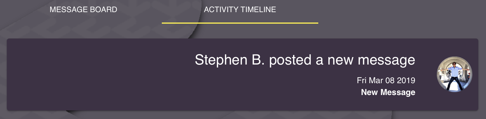
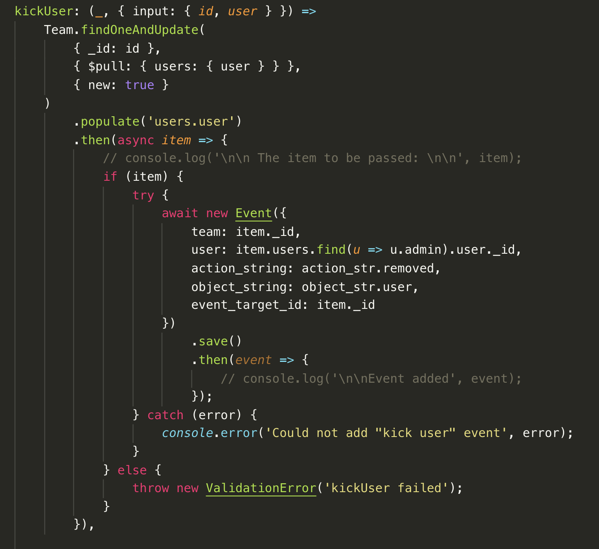
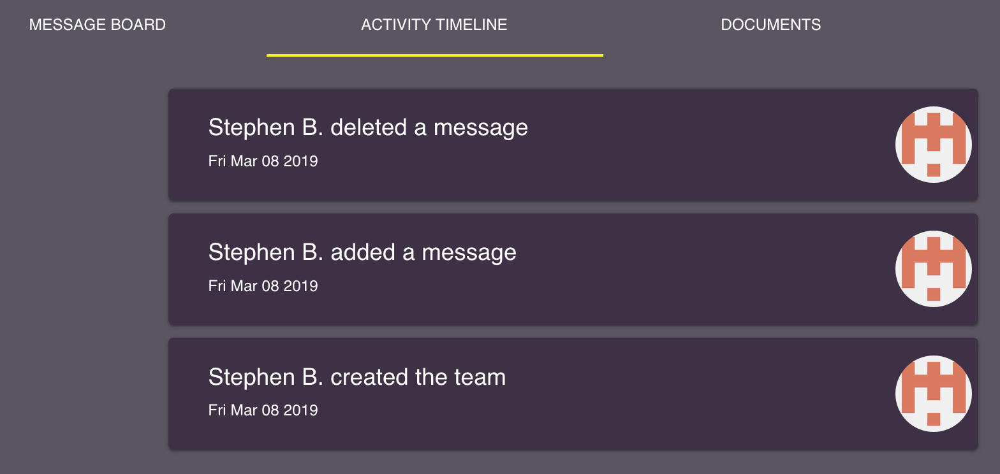

## Part 1 - Individual Accomplishments this Week

#### Your team’s github contribution graph and your Github:

[StephenBondor](https://github.com/StephenBondor)
-- [Team Contribution Graph](https://github.com/Lambda-School-Labs/labs-team-home/graphs/contributors)

#### This week

This week we began the process of finalizing our feature set and refactoring it into the code base we inherited from the previous labs team. Our new deploy is [here](https://team-home-2.netlify.com/).

> > List the tasks you pulled this week, and provide a link to the successfully merged PR completing that task and the trello card for that task. You must have at least one front end and one back end. The expected total is 6 with a minimum of 4.

**Ticket 1**
[Github](https://github.com/Lambda-School-Labs/labs-team-home/pull/353)
[Trello](https://trello.com/b/Ir0KPUDw/labs10-team-home-2)
**Ticket 2**
[Github](https://github.com/Lambda-School-Labs/labs-team-home/pull/354)
[Trello](https://trello.com/b/Ir0KPUDw/labs10-team-home-2)
**Ticket 3**
[Github](https://github.com/Lambda-School-Labs/labs-team-home/pull/355)
[Trello](https://trello.com/b/Ir0KPUDw/labs10-team-home-2)
**Ticket 4**
[Github](https://github.com/Lambda-School-Labs/labs-team-home/pull/363)
[Trello](https://trello.com/b/Ir0KPUDw/labs10-team-home-2)
**Ticket 5**
[Github](https://github.com/Lambda-School-Labs/labs-team-home/pull/367)
[Trello](https://trello.com/b/Ir0KPUDw/labs10-team-home-2)
**Ticket 6**
[Github](https://github.com/Lambda-School-Labs/labs-team-home/pull/374)
[Trello](https://trello.com/b/Ir0KPUDw/labs10-team-home-2)
**Ticket 7**
[Github](https://github.com/Lambda-School-Labs/labs-team-home/pull/378)
[Trello](https://trello.com/b/Ir0KPUDw/labs10-team-home-2)
**Ticket 8**
[Github](https://github.com/Lambda-School-Labs/labs-team-home/pull/380)
[Trello](https://trello.com/b/Ir0KPUDw/labs10-team-home-2)
**Ticket 9**
[Github](https://github.com/Lambda-School-Labs/labs-team-home/pull/381)
[Trello](https://trello.com/b/Ir0KPUDw/labs10-team-home-2)
**Ticket 10**
[Github](https://github.com/Lambda-School-Labs/labs-team-home/pull/383)
[Trello](https://trello.com/b/Ir0KPUDw/labs10-team-home-2)
**Ticket 11**
[Github](https://github.com/Lambda-School-Labs/labs-team-home/pull/386)
[Trello](https://trello.com/b/Ir0KPUDw/labs10-team-home-2)
**Ticket 12**
[Github](https://github.com/Lambda-School-Labs/labs-team-home/pull/392)
[Trello](https://trello.com/b/Ir0KPUDw/labs10-team-home-2)
**Ticket 13**
[Github](https://github.com/Lambda-School-Labs/labs-team-home/pull/392)
[Trello](https://trello.com/b/Ir0KPUDw/labs10-team-home-2)
**Ticket 14**
[Github](https://github.com/Lambda-School-Labs/labs-team-home/pull/394)
[Trello](https://trello.com/b/Ir0KPUDw/labs10-team-home-2)
**Ticket 15**
[Github](https://github.com/Lambda-School-Labs/labs-team-home/pull/398)
[Trello](https://trello.com/b/Ir0KPUDw/labs10-team-home-2)
**Ticket 16**
[Github](https://github.com/Lambda-School-Labs/labs-team-home/pull/403)
[Trello](https://trello.com/b/Ir0KPUDw/labs10-team-home-2)

#### Detailed Analysis

> > Pick one of your tickets and provide a detailed analysis of the work you did. This should be approximately ¼ page of text, and at least three screenshots.

##### Refactoring the Activity Timeline

As we worked through adding our own component to this website, we quickly came to realize that the present implementation of the Activity Timeline tab was more a loose interpretation of "Activity" than it was a strong one. As such, someone could perform the activity of creating something, and the activity timeline would reflect that:

_A New Message hits the activity timeline_

However, when someone performed an activity like `edit` or `delete`, the activity timeline would not display this information. And what is more, in some cases it would no longer show the original activity. For instance, if someone went back and deleted the previously made message the new activity timeline would be reflected as such:

_The Activity Timeline after performing two activities: 1. Create Message, and 2. Delete Message_

As is probably obvious to the ready, the reason the activity timeline does is this because it is jsut reading the date entries on the database and returning them in order. Thus, if something is deleted, it no longer exists in the database, and thus _can not_ exist on the Activity Timeline. Which is to say, the old Activity Timeline simply printed the state of the database in chronological order. In my opinion, this implementation of this tab is less of an "Activity Timeline," and more of a "Current State of the Team"

So, we refactored it.

Our solution to this problem was to create a new Event Schema in the database. We then wrapped all other events in the Resolvers with a type of event listener which would populate this new model with `new Event` entries every time a user interacted with the site.

_Adding an Event_

The above code needed to be applied to over 30 events. Which was pretty _not dry_ and painful, but the computer science necessary to do it more efficiently is def beyond us at this point in our education. However, once completed, it radically improved the efficiency on the front end processing. Instead of having to make 7 queries into the database using graphQL, now, only one query was needed to populate the entire Activity Timeline, and that activity was a historical representation of everything that has happened to a team.

_The Activity Timeline after performing two activities: 1. Create Message, and 2. Delete Message_

---

> As a part of your journal entry, write ¼ to ½ a page reflecting on your experiences working with a team to make your product look and feel as good as it works under the hood. Describe how the duties of you and your team shifted tasks shifted towards the front end - and debugging the back end to improve UX.

See the story above. That said, debugging 30+ unique event entries on the back end was not easy or fun. But in the end, it radically improved the end user experience.

> As a group, provide documentation of your progress and remaining tasks:
> Link to each page and describe any remaining bugs, fixes, or tasks that need to be completed on that page

[Running Front End bug list](https://github.com/Lambda-School-Labs/labs-team-home/blob/labs10-master/frontend/FRONTEND_BUG_REPORT.md)
